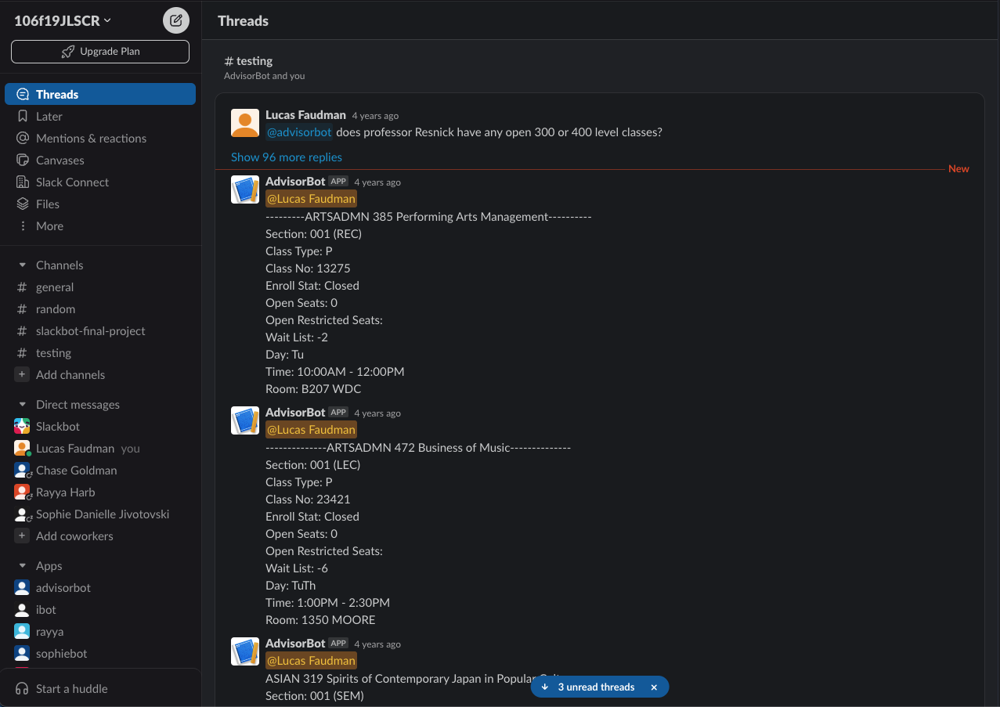

# advisorBot.py
A multithreaded slack bot that preforms the job of a University of Michigan student advisor. 

### Description:
advisorBot is a multithreaded slack bot that preforms the job of a University of Michigan student advisor. It is able to answer questions about LS&A degree requirements, course descriptions, and course availabilities and more. It is also able to provide a list of courses that satisfy a given requirement.

Screenshot: 
